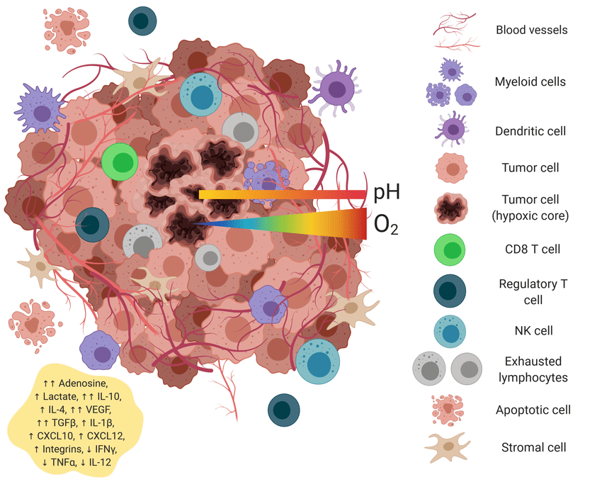
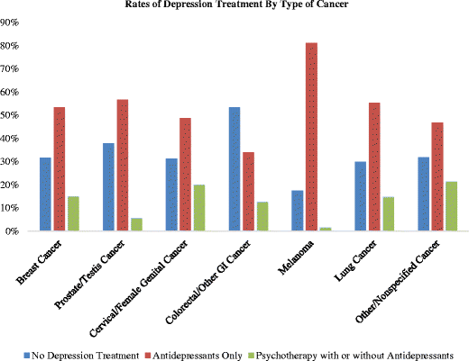

# Analysis: Can a Cancer Patient Live a Normal Life?

## Table of Contents
1. [Abstract](#abstract)
2. [What is Cancer?](#what-is-cancer)
   - [Cancer History](#cancer-history)
   - [Origin](#origin)
   - [How Cancer is Formed](#how-cancer-is-formed)
3. [How Different is Their Life from the Daily Life of an Ordinary Person?](#how-different-is-their-life-from-the-daily-life-of-an-ordinary-person)
   - [Daily Routine Adjustments](#daily-routine-adjustments)
   - [Impact on Social Dynamics](#impact-on-social-dynamics)
   - [Quality of Life Considerations](#quality-of-life-considerations)
4. [How Much Extra Care and Attention They Needed](#how-much-extra-care-and-attention-they-needed)
   - [Comprehensive Medical Care](#comprehensive-medical-care)
   - [Family and Caregiver Roles](#family-and-caregiver-roles)
5. [Their Trauma, Anxiety, Depression, and Their Solutions, How They Can Keep Their Mind Fresh](#their-trauma-anxiety-depression-and-their-solutions-how-they-can-keep-their-mind-fresh)
   - [Psychological Impact](#psychological-impact)
   - [Holistic Approaches](#holistic-approaches)
   - [Survivorship and Post-Treatment Challenges](#survivorship-and-post-treatment-challenges)
6. [Is Cancer Genetic?](#is-cancer-genetic)
   - [Genetic Predisposition](#genetic-predisposition)
   - [Treatment Implications](#treatment-implications)
   - [Ethical and Social Implications](#ethical-and-social-implications)
7. [Is Cancer Contagious?](#is-cancer-contagious)
   - [Understanding Disease Transmission](#understanding-disease-transmission)
   - [Public Health Initiatives](#public-health-initiatives)
   - [Global Health Considerations](#global-health-considerations)
8. [Living with Cancer: A Comprehensive Guide](#living-with-cancer-a-comprehensive-guide)
   - [Coping with Emotions](#coping-with-emotions)
   - [Communicating with Healthcare Providers](#communicating-with-healthcare-providers)
   - [Engaging with Family and Friends](#engaging-with-family-and-friends)
   - [Adapting to Changes in Self-Image](#adapting-to-changes-in-self-image)
   - [Life After Treatment](#life-after-treatment)
9. [Case Studies](#case-studies)
   - [Case Study 1: Treatment Outcomes in Advanced Melanoma](#case-study-1-treatment-outcomes-in-advanced-melanoma)
   - [Case Study 2: Socioeconomic Impacts of Breast Cancer in Urban vs. Rural Settings](#case-study-2-socioeconomic-impacts-of-breast-cancer-in-urban-vs-rural-settings)
   - [Case Study 3: Genetic Testing in Familial Cancer Risk](#case-study-3-genetic-testing-in-familial-cancer-risk)
10. [Conclusion](#conclusion)
11. [References](#references)

---

## Abstract

Cancer is more than just a physical illness; it deeply affects a person’s emotions and mental health. Imagine the constant worry and fear that come with fighting this disease every day. This article looks into the emotional struggles that cancer patients face. They often deal with anxiety, fear of the unknown, and feelings of sadness. Despite these challenges, they are still the same people at heart, hoping to enjoy the simple pleasures of life. They want to be treated with kindness and understanding, just like everyone else. Their stories show the strength of the human spirit and highlight the importance of empathy and compassion in their journey. This paper investigates the resilience of cancer patients in maintaining normalcy amidst their condition, exploring their daily adjustments, care needs, psychological impacts, genetic predispositions, and common misconceptions. Through this examination, the study aims to offer hope and support to cancer patients, emphasizing their shared human experiences and resilience in facing adversity.

---

## What is Cancer?

### Cancer History

Cancer has been recognized for thousands of years. Ancient manuscripts, such as the Edwin Smith Papyrus from 1600 BC, document cases of tumors and surgical treatments. The term "cancer" derives from the Greek word "karkinos," meaning crab, coined by Hippocrates (460-370 BC) to describe the appearance of tumor projections. In the Middle Ages, advancements in medical knowledge were limited, but by the Renaissance, increased anatomical knowledge led to more detailed studies of cancer. The 18th and 19th centuries saw significant progress with the identification of different cancer types and the development of surgical techniques. In the 20th century, the discovery of X-rays and the development of radiation therapy, chemotherapy, and targeted therapies revolutionized cancer treatment. Today, cancer research continues to advance, focusing on personalized medicine and immunotherapy.

### Origin

Cancer originates from normal cells that undergo genetic mutations, leading to uncontrolled growth and division. These mutations can be induced by various factors, including environmental exposures such as tobacco smoke, radiation, and certain chemicals. Lifestyle choices, such as diet, physical inactivity, and alcohol consumption, also play a significant role in increasing cancer risk. Additionally, some individuals inherit genetic mutations that predispose them to certain types of cancer. Over time, these genetic changes accumulate and disrupt normal cellular functions, such as cell cycle regulation, apoptosis (programmed cell death), and DNA repair mechanisms. This disruption allows cells to grow and divide uncontrollably, leading to the formation of malignant tumors. These tumors can invade surrounding tissues and spread to other parts of the body through a process known as metastasis. Understanding the multifactorial nature of cancer's origins has been crucial in developing prevention strategies, early detection methods, and targeted treatments to combat this complex disease.

  

  The image illustrates Normal and Cancer Cells Structure.

### How Cancer is Formed

Cancer formation is a multistep process involving:
1. **Initiation**: Genetic mutations occur in the DNA of a single cell, often due to carcinogenic exposures or inherited predispositions.
2. **Promotion**: Mutated cells begin to proliferate abnormally, bypassing normal regulatory mechanisms.
3. **Progression**: Abnormal cells invade surrounding tissues and can metastasize to distant organs through the bloodstream or lymphatic system.

  

  The image illustrates the formation of a tumor, highlighting the complex interactions between cancer cells and their surrounding microenvironment.

##### How a Normal Cell Turns into a Cancer Cell

| Stage                    | Description                                                                                           |
|--------------------------|-------------------------------------------------------------------------------------------------------|
| **Normal Cell**          | Cells function normally, with regulated growth, division, and apoptosis.                              |
| **Genetic Mutation**     | DNA damage occurs due to environmental factors, lifestyle choices, or inherited mutations.            |
| **DNA Repair Failure**   | The cell's mechanisms to repair DNA damage fail, allowing mutations to persist.                       |
| **Uncontrolled Growth**  | Mutations in genes regulating cell cycle and apoptosis lead to unchecked cell proliferation.           |
| **Formation of Tumor**   | Accumulation of mutated cells forms a benign tumor that may become malignant over time.                |
| **Invasion**             | Malignant tumor cells invade surrounding tissues, breaking through normal tissue boundaries.           |
| **Metastasis**           | Cancer cells spread to other parts of the body via the bloodstream or lymphatic system.                |

---

## How Different is Their Life from the Daily Life of an Ordinary Person?

Living with cancer transforms an individual's life in profound and often heartbreaking ways. For a cancer patient, the daily rhythm is dictated not by routine but by the relentless demands of treatment and the pervasive uncertainty of their condition. Where once their days were filled with the familiar cadence of work, family, and leisure, they are now punctuated by frequent medical appointments, exhausting treatment regimens, and a constant battle with debilitating side effects. The physical toll is immense—fatigue, pain, and nausea become constant companions, stripping away their independence and altering their ability to engage in once-simple activities. 

Emotionally, the impact is equally devastating. The anxiety of an uncertain future looms large, often accompanied by feelings of isolation as social connections wane under the strain of illness. The financial burden can be overwhelming, as the costs of treatment and the inability to work lead to significant economic hardship. In this altered reality, every aspect of life requires adjustment—from nutritional needs and daily routines to long-term planning and reliance on support systems. 

The life of a cancer patient is marked by resilience and courage, but it is undeniably different from the daily life of an ordinary person. It is a life redefined by the continuous struggle for survival, a poignant reminder of the fragility of health and the indomitable human spirit.

### Daily Routine Adjustments

Cancer significantly disrupts daily life, requiring major adjustments:
- **Medical Appointments**: Frequent visits to doctors, undergoing diagnostic tests, and receiving treatments such as chemotherapy or radiation therapy.
- **Treatment Regimens**: Adhering to complex medication schedules, managing side effects, and balancing energy levels.
- **Physical Challenges**: Dealing with fatigue, pain, nausea, and other side effects that can limit physical activity and independence.
- **Psychosocial Impact**: Experiencing emotional distress, anxiety about the future, and changes in social relationships.
- **Financial Burden**: Facing high medical costs, potential loss of income due to inability to work, and navigating insurance issues.
- **Nutritional Needs**: Adjusting diet to manage symptoms and side effects, and to maintain strength and body weight.
- **Daily Routines**: Modifying or reducing daily activities, requiring assistance with household tasks and personal care.
- **Support Systems**: Relying more on family, friends, and support groups for emotional and practical support.
- **Work and Education**: Taking time off work or school, dealing with cognitive effects of treatment, and managing the impact on career or academic progress.
- **Long-Term Planning**: Reevaluating future plans and goals, making legal and financial arrangements, and considering the possibility of relapse or long-term remission.

### Impact on Social Dynamics

- **Social Isolation**: Cancer patients may withdraw from social activities due to fatigue or fear of infection.
- **Financial Strain**: Increased medical costs and potential loss of income due to inability to work can lead to significant financial challenges.
- **Changes in Relationships**: Shifts in family dynamics and roles, as well as the need for emotional support from friends and loved ones.

### Quality of Life Considerations

- **Functional Limitations**: Adjustments to daily routines and activities to accommodate physical and emotional changes.
- **Healthcare Access**: Variability in access to specialized care, treatments, and support services based on geographic, economic, or insurance factors.

---

## How Much Extra Care and Attention They Needed

Cancer patients require an extraordinary amount of care and attention, far beyond what is needed in a typical daily routine. The intensity of their medical needs demands frequent visits to healthcare providers for treatments such as chemotherapy, radiation, and surgeries. These treatments often come with severe side effects, necessitating constant monitoring and management of symptoms like nausea, pain, and fatigue. 

Additionally, cancer patients need assistance with daily activities that they once performed independently. Simple tasks such as cooking, cleaning, and personal care can become overwhelming, requiring the support of caregivers and family members. The emotional toll of the disease also necessitates psychological support to help them cope with anxiety, depression, and fear of the future. 

Nutritional needs become a critical focus as patients must maintain their strength and manage side effects that affect appetite and digestion. This often involves specialized diets and meal planning, further adding to the care requirements. The financial strain of cancer treatment can also mean that patients need help navigating insurance, financial aid, and employment issues.

The extra care and attention extend to their social and emotional well-being, requiring a robust support system of friends, family, and professional counselors to provide the necessary emotional and practical support. The comprehensive care required by cancer patients is a testament to the profound impact of the disease on every aspect of their lives.

### Comprehensive Medical Care

- **Oncological Oversight**: Coordination of care involving oncologists, surgeons, radiologists, and other healthcare professionals to ensure comprehensive treatment planning.
- **Supportive Therapies**: Integrative approaches such as pain management, nutritional counseling, and physical therapy to support overall well-being.
- **Palliative Care**: Focused on improving quality of life through symptom management and emotional support, often in advanced stages of cancer.

### Family and Caregiver Roles

- **Caregiver Burden**: Significant impact on family members who may need to provide extensive physical and emotional care, leading to potential caregiver burnout.
- **Educational Support**: Providing caregivers with information on disease management, treatment side effects, and available support resources.

---

## Their Trauma, Anxiety, Depression, and Their Solutions, How They Can Keep Their Mind Fresh

### Psychological Impact

- **Emotional Turmoil**: Initial shock of diagnosis, ongoing anxiety about treatment outcomes, and existential fears challenge mental health.
- **Depressive Symptoms**: Common among cancer patients, including persistent sadness, loss of interest, and difficulty coping with daily life.
- **Coping Mechanisms**: Effective strategies include cognitive-behavioral therapy, support groups, mindfulness practices, and relaxation techniques.

### Holistic Approaches

- **Mind-Body Interventions**: Practices such as yoga, meditation, and relaxation techniques can help alleviate stress and promote emotional resilience.
- **Peer Support Networks**: Connecting with others who have similar experiences can provide emotional support and reduce feelings of isolation.

### Survivorship and Post-Treatment Challenges

- **Long-term Effects**: Managing physical and psychological aftereffects of treatment, such as chronic fatigue, cognitive changes, and fear of recurrence.
- **Health Maintenance**: Emphasizing healthy lifestyle choices, regular follow-up care, and survivorship care plans to support ongoing wellness.

  

  The graph illustrates the rate of depression treatment by type of cancer among adults with cancer and comorbid depression.

#### How can we, as friends, family, and caregivers, help a cancer patient find moments of joy and mental peace amidst their challenging journey?

Supporting a loved one with cancer goes beyond medical care; it's about nurturing their spirit and providing emotional comfort. Amidst the uncertainty and pain, our role is to be a beacon of hope and positivity. Simple acts like sharing a favorite memory, engaging in light-hearted activities, or even just sitting in silence can make a world of difference. Creating a supportive environment where they feel understood and loved is crucial. Encouraging small, manageable goals can help them focus on the present rather than the overwhelming future. Listening without judgment, offering gentle words of encouragement, and reminding them of their inner strength can uplift their spirits. Our empathy, patience, and unwavering support can be powerful tools in helping them find moments of joy and resilience during this difficult time.

---

## Is Cancer Genetic?

Cancer has a complex relationship with genetics. While not all cancers are inherited, genetics can play a significant role in an individual's risk of developing the disease. Some cancers are linked to inherited genetic mutations passed down from parents to their children. These mutations can significantly increase the likelihood of developing certain types of cancer, such as breast, ovarian, and colorectal cancers. However, most cancers are caused by acquired genetic mutations that occur during a person's lifetime due to environmental factors, lifestyle choices, and random errors in DNA replication. Thus, while genetics can predispose individuals to cancer, environmental and lifestyle factors often trigger its development.

### Genetic Predisposition

- **Hereditary Factors**: Some cancers are linked to inherited genetic mutations, such as BRCA1/2 mutations in breast and ovarian cancers.
- **Family History**: Assessing family history of cancer can help identify individuals at higher genetic risk and inform screening protocols.
- **Genetic Counseling**: Provides personalized risk assessment and guidance on genetic testing and preventive measures.

#### Table: Genetic Testing Insights

| Genetic Test      | Implications                                                                                      |
|-------------------|--------------------------------------------------------------------------------------------------|
| BRCA1/2 Mutation  | 50% chance of inheriting mutation from an affected parent; informs decisions on preventive surgeries. |
| Genetic Counseling| Reduces anxiety and facilitates informed decision-making regarding screening and preventive measures. |

### Treatment Implications

- **Targeted Therapies**: Advances in precision medicine allow for treatments tailored to specific genetic profiles of tumors.
- **Clinical Trials**: Opportunities to participate in studies testing new therapies based on genetic insights.

### Ethical and Social Implications

- **Privacy Concerns**: Ensuring the confidentiality of genetic information and addressing potential discrimination in employment or insurance.
- **Access to Testing**: Promoting equitable access to genetic testing and counseling services across diverse populations.

---

## Is Cancer Contagious?

No, cancer is not contagious. Unlike infectious diseases caused by bacteria, viruses, or other pathogens, cancer cannot be spread from person to person through direct contact, sharing utensils, or breathing the same air. Cancer arises from the uncontrolled growth and division of the body's own cells due to genetic mutations, which can be influenced by factors such as environmental exposures, lifestyle choices, and inherited genetic predispositions. However, some viruses and bacteria, such as human papillomavirus (HPV) and Helicobacter pylori, can increase the risk of developing certain types of cancer, but the infections themselves, not the cancer, are what can be transmitted.

### Understanding Disease Transmission

- **Clarifying Misconceptions**: Cancer is not contagious and cannot be spread from person to person through casual contact.
- **Viral Links**: Certain viruses (e.g., HPV, Hepatitis B) can increase cancer risk but do not make cancer itself contagious.

### Public Health Initiatives

- **Vaccination Programs**: HPV and Hepatitis B vaccines reduce the risk of virus-associated cancers.
- **Awareness Campaigns**: Educating the public about cancer risk factors and prevention strategies.

### Global Health Considerations

- **Resource Allocation**: Addressing disparities in cancer care access and prevention efforts across different regions.
- **Collaborative Efforts**: International partnerships to advance research, share knowledge, and improve cancer outcomes globally.
 

  

  The graph depicts factors influencing cancer preventive behaviors in various regions.

---

## Living with Cancer: A Comprehensive Guide

### Coping with Emotions

Living with cancer evokes a range of emotions including sadness, anger, fear, and guilt. These feelings are normal and may fluctuate over time. Effective ways to cope include:
- **Talking Openly**: Sharing your thoughts and feelings with trusted individuals, such as friends, family, or counselors.
- **Journaling**: Writing about your experiences and emotions can provide an emotional outlet and clarity.
- **Relaxation Techniques**: Practices like meditation, deep breathing, and progressive muscle relaxation can reduce stress and promote calmness.
- **Enjoyable Activities**: Engaging in hobbies and activities that bring joy and provide a mental break from cancer-related thoughts.

Seeking professional support is crucial if emotions become overwhelming or if symptoms of depression, anxiety, or stress persist.

### Communicating with Healthcare Providers

Effective communication with your healthcare team is essential for optimal care and support:
- **Expressing Preferences**: Clearly communicate how much detail you want about your treatment and condition.
- **Preparing Questions**: Write down questions and concerns before appointments to ensure all your issues are addressed.
- **Support During Visits**: Bring a family member or friend to appointments to help take notes and provide additional support.

### Engaging with Family and Friends

Cancer alters roles and routines within families and support networks. Open communication about changing needs and roles is beneficial:
- **Discussing Changes**: Talk about how your needs and roles have changed, and how family and friends can best support you.
- **Social Worker Support**: Social workers or care team members can facilitate discussions and provide resources for both patients and caregivers.

### Adapting to Changes in Self-Image

Cancer treatments may lead to physical changes such as fatigue, scars, or hair loss, impacting self-esteem and intimacy. Strategies for coping and adjustment include:
- **Exercise**: Incorporating gentle exercise, with medical approval, to maintain physical health and boost mood.
- **Confidence-Building Activities**: Participating in activities that foster self-confidence and engagement, such as hobbies or volunteer work.
- **Counseling**: Seeking counseling for sexual concerns or body image issues to address and overcome these challenges.

### Life After Treatment

Following treatment, regular follow-up care is essential. This period offers an opportunity to discuss challenges and adjustments necessary for establishing a "new normal" with cancer as part of life:
- **Follow-Up Care**: Regular check-ups to monitor health and manage any long-term side effects of treatment.
- **Adjusting to New Normal**: Adapting to a new lifestyle that accommodates changes brought by cancer and its treatment.
- **Support Networks**: Continuing to engage with support groups and healthcare providers to maintain emotional and physical well-being.

By understanding and addressing these aspects, individuals can navigate the challenges of living with cancer more effectively, fostering resilience and improving quality of life.

---

## Case Studies

### Case Study 1: Treatment Outcomes in Advanced Melanoma

#### Background
A 45-year-old female was diagnosed with advanced melanoma, a severe form of skin cancer known for its aggressive nature and potential for metastasis. She presented with multiple skin lesions and lymph node involvement, indicating advanced disease.

#### Problem Highlighted
The patient faced significant physical and emotional challenges, including severe pain, fatigue, and anxiety about her prognosis. Traditional chemotherapy had limited effectiveness, and the patient sought more targeted treatment options.

#### Treatment Approach
The healthcare team decided to implement targeted therapy using BRAF inhibitors, given the presence of a BRAF mutation in the patient's tumor. This precision medicine approach aimed to specifically target and inhibit the mutated protein driving the cancer's growth.

#### Outcome
- **Tumor Regression**: Significant reduction in tumor size and number of lesions.
- **Improved Quality of Life**: Enhanced daily functioning, reduced pain, and improved emotional well-being.
- **Adverse Effects**: The patient experienced manageable side effects, which were promptly addressed by the healthcare team.
- **Psychological Support**: Continuous psychological counseling helped the patient cope with anxiety and maintain a positive outlook.

  

---

### Case Study 2: Socioeconomic Impacts of Breast Cancer in Urban vs. Rural Settings

#### Background
A comparative study was conducted to evaluate the socioeconomic impacts of breast cancer on patients in urban and rural settings. The study involved 100 participants from each setting, analyzing their access to care, treatment outcomes, and financial burdens.

#### Problem Highlighted
The study revealed significant disparities between urban and rural patients. Urban patients generally had better access to specialized care, early detection programs, and support services, leading to improved outcomes. In contrast, rural patients faced challenges such as limited access to healthcare facilities, delayed diagnoses, and higher out-of-pocket expenses.

#### Key Findings
- **Urban Patients**: Demonstrated better survival rates and quality of life due to proximity to specialized centers and comprehensive care.
- **Rural Patients**: Experienced delayed diagnosis and treatment, limited access to supportive care, and greater financial strain due to travel costs and lost income.

#### Recommendations
- **Policy Interventions**: Improve healthcare infrastructure and access in rural areas.
- **Support Programs**: Establish financial aid and support services for rural patients.
- **Telemedicine**: Expand telemedicine services to bridge the gap in care access.

  

---

### Case Study 3: Genetic Testing in Familial Cancer Risk

#### Background
A family with a strong history of colorectal cancer sought genetic counseling to understand their risk and take preventive measures. Multiple family members had been diagnosed with colorectal cancer at relatively young ages, prompting concerns about a hereditary cancer syndrome.

#### Problem Highlighted
The family faced anxiety about their cancer risk and uncertainty about appropriate screening and prevention strategies. There was a need for accurate risk assessment and guidance on genetic testing.

#### Genetic Testing and Findings
- **BRCA1 Mutation**: Genetic testing identified a BRCA1 mutation, indicating a higher risk for colorectal and other cancers.
- **Family Impact**: The results prompted proactive screening and preventive strategies among family members, including more frequent colonoscopies and consideration of prophylactic surgeries.

#### Outcome
- **Reduced Anxiety**: Genetic counseling provided clarity and reduced anxiety by informing family members of their specific risks and options.
- **Empowered Decision-Making**: Family members felt empowered to make informed decisions about their health, including lifestyle changes and medical interventions.
- **Preventive Measures**: Implementation of regular screenings and preventive measures led to early detection and improved outcomes for at-risk family members.

---

## Conclusion

Living with cancer challenges individuals to redefine normalcy amidst profound physical, emotional, and social upheavals. The disease imposes significant physical burdens, including the side effects of treatments like chemotherapy and radiation, which can cause fatigue, pain, nausea, and other debilitating symptoms. Emotionally, cancer patients grapple with anxiety, depression, and the constant fear of the unknown. Socially, they may experience isolation due to the rigorous demands of their treatment schedules and the changes in their ability to participate in everyday activities.

Through multidisciplinary care, which includes oncologists, surgeons, radiologists, and specialized nurses, patients receive comprehensive treatment that addresses various aspects of the disease. Psychological resilience is fostered through counseling, support groups, and mental health services, helping patients cope with the emotional toll of cancer. Genetic insights have revolutionized personalized medicine, allowing for targeted therapies based on an individual's genetic makeup, improving treatment outcomes and offering hope for those with hereditary cancer risks.

Public education plays a crucial role in addressing misconceptions about cancer, promoting early detection, and encouraging preventive measures. Creating supportive environments, both at home and in the community, is essential for improving the quality of life and societal integration of cancer patients. This includes fostering understanding among peers, accommodating the unique needs of cancer survivors in the workplace, and ensuring access to necessary resources and support systems. By addressing these multifaceted challenges, cancer patients can navigate their journey with greater ease and lead meaningful lives despite the adversity they face.

---

## References

1. American Cancer Society. (2023). Living as a Cancer Survivor.
2. National Cancer Institute. (2023). Coping with Cancer.
3. Mayo Clinic. (2023). Cancer Care and Support.
4. World Health Organization. (2023). Cancer Fact Sheets.
5. Genetics Home Reference. (2023). BRCA1 and BRCA2: Cancer Risk and Genetic Testing.

  
**> "You are braver than you believe, stronger than you seem, and loved more than you know. In this tough face, your courage shines brighter than any diagnosis. Cancer may be a part of your story, but it doesn't define your whole life.**

