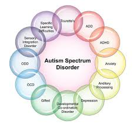

# Autism Spectrum Disorder


Autism Spectrum Disorder (ASD) is a neurological and developmental disorder that affects communication, social interaction, and behavior. It is a spectrum disorder, meaning that it affects individuals to varying degrees and in different ways.


## Table of Content

1. [About](#about)
2. [Symptoms](#symptoms)
3. [Types of ASD](#types-of-ASD)
    [Autistic Disorder](#autistic-disorder)
    [Asperger Syndrome](#asperger-syndrome)
    [Pervasive Developmental Disorder](#pervasive-developmental-disorder)
4.[Causes](#causes)
4. [Medical Myths](#medical-myths)
5. [Treatment and Interventions](#treatment-and-interventions)
6. [Accommodations and Supports](#accommodations-and-supports)
7. [Resources](#resources)


# About
Autism Spectrum Disorder (ASD) is a complex neurodevelopmental condition characterized by a range of challenges in social interaction, communication, and behavior. The term "spectrum" reflects the wide variety of symptoms and severity levels that individuals with autism can experience. While some people with ASD may have significant cognitive or language impairments, others may be highly skilled in specific areas, such as mathematics, music, or visual arts.

ASD is typically diagnosed in early childhood, although signs can be detected as early as 18 months. The exact cause of autism is not fully understood, but it is believed to result from a combination of genetic and environmental factors. Advances in research have led to better understanding and earlier diagnosis, but there is still much to learn about the condition.

Living with autism presents unique challenges, not only for those diagnosed with the disorder but also for their families, caregivers, and communities. However, with appropriate support, individuals with ASD can lead fulfilling lives and contribute meaningfully to society. Increasing awareness and understanding of autism is crucial to fostering acceptance and creating inclusive environments where everyone can thrive.



## Symptoms 
The symptoms of ASD can vary widely in severity and impact. Some common symptoms include:

Difficulty with verbal and nonverbal communication
Difficulty with social interactions and relationships
Restricted and repetitive patterns of behavior, interests, or activities
Sensory sensitivities or difficulties with sensory integration
Delays in cognitive development
Difficulty with changes in routine or transitions.

## There are several subtypes of ASD, including:

- **Autistic Disorder:** Also known as autism, this is the most severe form of ASD. Individuals with autistic disorder typically have significant delays in language development and cognitive function.
- **Asperger Syndrome:** This is a milder form of ASD, characterized by difficulties with social interaction and communication, but without significant delays in language development or cognitive function.
- **Pervasive Developmental Disorder (PDD-NOS):** This is a diagnosis given to individuals who do not meet the criteria for autistic disorder or Asperger syndrome, but who still have significant difficulties with social interaction and communication.


## Causes and Risk Factors
The exact causes of ASD are not yet fully understood, but research suggests that it is likely to be caused by a combination of genetic and environmental factors. Some known risk factors for ASD include:

- Family history of ASD
- Premature birth
- Low birth weight
- Maternal age over 35
- Prenatal exposure to certain toxins

## Treatment and Interventions

There is no cure for ASD, but there are several treatments and interventions that can help individuals with ASD to manage their symptoms and improve their quality of life. These include:

**Behavioral therapies**
``Such as applied behavior analysis (ABA) and positive behavior supports (PBS)``
**Speech and language therapy**
``To improve communication skills
Occupational therapy: To improve daily living skills and sensory integration``
**Medications**
```To manage symptoms such as anxiety, hyperactivity, and sleep disturbances```
**Dietary and nutritional interventions**
```Such as gluten-free and casein-free diets```

## Accommodations and Supports

Individuals with ASD may require accommodations and supports to help them navigate daily life. These can include:

- Individualized Education Programs (IEPs): To provide specialized education and support in school
- Accommodations in the workplace: Such as flexible scheduling and job restructuring
- Supports in daily living: Such as assistance with daily routines and tasks
- Respite care: To provide temporary relief for caregivers

## Resources

**Autism Society**
A national organization that provides information, resources, and support for individuals with ASD and their families.
**Autism Speaks**
A national organization that provides information, resources, and support for individuals with ASD and their families.
**National Autism Association**
A national organization that provides information, resources, and support for individuals with ASD and their families.

## Key Facts

 <p> ➤Autism Spectrum Disorder affects approximately 1 in 36 children in the United States, making it one of the most common developmental disorders.</p>
 <p> ➤ ASD is referred to as a "spectrum" because it includes a wide range of symptoms, skills, and levels of disability, from highly functioning individuals to those who require substantial support.</p>
  <p> ➤ Early signs of ASD can appear as early as 18 months of age and may include delayed speech development, limited eye contact, and repetitive behaviors. Early diagnosis and intervention are crucial for improving outcomes.</p>
 <p> ➤ The exact cause of ASD is not fully understood, but it is believed to be a result of a combination of genetic and environmental factors. Having a sibling with ASD increases the likelihood of a diagnosis.</p>

<br>
<p align="center"><strong>Take action today for a healthier tomorrow. 💙</strong></p>