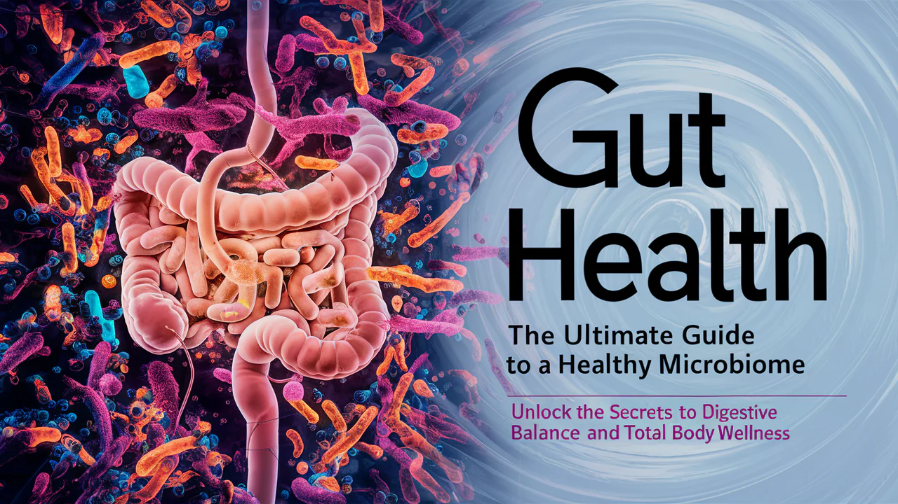

# Analysis: Gut Health: The Gateway to Overall Well-Being!!
<!----------------------------------------------------- Contents ------------------------------------------------>
## Table of Contents
1. [About](#about)
2. [Importance of Gut Health](#importance-of-gut-health)
3. [Factors Affecting Gut Health](#factors-affecting-gut-health)
   - [Diet](#diet)
   - [Lifestyle](#lifestyle)
   - [Medications](#medications)
4. [Symptoms of Poor Gut Health](#symptoms-of-poor-gut-health)
5. [Improving Gut Health](#improving-gut-health)
6. [When to See a Doctor?](#when-to-see-a-doctor)
7. [Conclusion](#conclusion)
8. [References](#references)

---

## About

**Gut health** refers to the balance and function of bacteria and other microorganisms in the digestive tract. A healthy gut contributes to a strong immune system, heart health, brain health, improved mood, healthy sleep, and effective digestion. It may help prevent some cancers and autoimmune diseases.

The gut microbiome, which consists of trillions of microorganisms, plays a crucial role in overall health. These microorganisms aid in digesting food, producing vitamins, and protecting against harmful bacteria.

A healthy gut contains a diverse community of microbes, which is beneficial for the body. An imbalance in these microorganisms can lead to digestive issues, obesity, diabetes, liver disease, heart disease, and cancer.

  

## Importance of Gut Health

Maintaining a healthy gut is essential for overall well-being. The gut is responsible for several critical functions:

- **Digestion and Absorption:** Proper gut function ensures efficient digestion and absorption of nutrients from food.
- **Immune Function:** A large portion of the immune system is located in the gut, where it helps protect against infections.
- **Mental Health:** The gut-brain axis links gut health to mental health, influencing mood and cognitive functions.
- **Hormone Production:** Gut bacteria are involved in the production of certain hormones and neurotransmitters.
- **Detoxification:** The gut helps detoxify and eliminate waste products from the body.

## Factors Affecting Gut Health

Several factors can influence gut health:

### Diet

- **Fiber-Rich Foods:** Promote the growth of beneficial bacteria.
- **Probiotics and Prebiotics:** Support a healthy gut microbiome.
- **Processed Foods and Sugars:** Can disrupt the balance of gut bacteria.

### Lifestyle

- **Stress:** Chronic stress can negatively impact gut health.
- **Exercise:** Regular physical activity promotes a healthy gut.
- **Sleep:** Poor sleep quality can affect the gut microbiome.

### Medications

- **Antibiotics:** Can disrupt the balance of gut bacteria.
- **Nonsteroidal Anti-Inflammatory Drugs (NSAIDs):** May cause gut inflammation.

## Symptoms of Poor Gut Health

Signs that your gut may be unhealthy include:

- **Digestive Issues:** Gas, bloating, constipation, diarrhea, and heartburn.
- **Food Intolerances:** Difficulty digesting certain foods.
- **Fatigue and Sleep Disturbances:** Poor gut health can lead to chronic fatigue and sleep issues.
- **Skin Conditions:** Eczema and other skin issues may be linked to gut health.
- **Autoimmune Conditions:** An imbalanced gut microbiome may trigger autoimmune responses.

## Improving Gut Health

To improve and maintain gut health, consider the following tips:

- **Eat a Diverse Range of Foods:** Include a variety of fruits, vegetables, whole grains, and legumes in your diet.
- **Consume Fermented Foods:** Yogurt, kefir, sauerkraut, kimchi, and other fermented foods provide beneficial bacteria.
- **Take Probiotics and Prebiotics:** Supplements can help restore and maintain a healthy gut microbiome.
- **Stay Hydrated:** Drinking plenty of water aids digestion and nutrient absorption.
- **Manage Stress:** Practice relaxation techniques such as yoga, meditation, and deep breathing exercises.
- **Exercise Regularly:** Physical activity promotes the growth of beneficial gut bacteria.
- **Get Enough Sleep:** Aim for 7-8 hours of quality sleep per night.

## When to See a Doctor?

You should see a healthcare professional if you experience:

- **Persistent Digestive Issues:** Chronic bloating, constipation, or diarrhea.
- **Severe Abdominal Pain:** Unexplained and severe stomach pain.
- **Unintended Weight Loss:** Sudden and unexplained weight loss.
- **Blood in Stool:** Presence of blood in your stool or black, tarry stools.
- **Symptoms of Nutrient Deficiencies:** Fatigue, weakness, or other signs of nutrient deficiencies.

## Conclusion

Gut health is a critical component of overall well-being that influences various aspects of physical and mental health. By maintaining a healthy diet, managing stress, staying active, and getting adequate sleep, you can support a healthy gut microbiome. Recognizing the signs of poor gut health and taking proactive steps to improve it can lead to better digestion, a stronger immune system, and enhanced overall health.

Understanding the importance of gut health and integrating healthy habits into daily life can significantly improve overall well-being. Prioritizing gut health is not just a health choice but a fundamental step towards a healthier and more vibrant life.

---

## References

1. Mayo Clinic
2. National Institute Of Health (NIH)

**>"Good health starts in the gut. Nourish your microbiome for a healthier life."**

