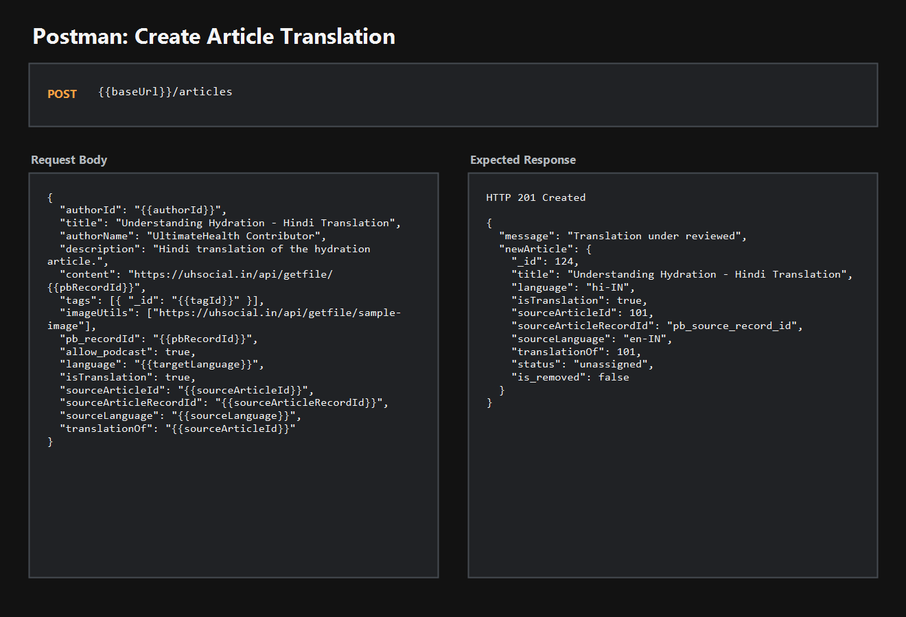
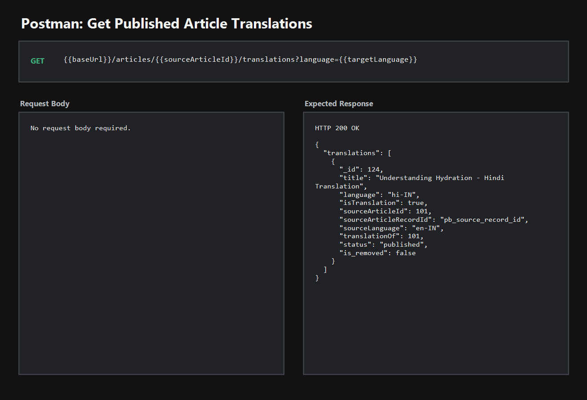

# Article Translation API Verification

This guide documents the Postman request/response flow for the article translation backend support added in this PR.

## Tooling

- Postman is enough to test this flow.
- No Visual Studio or VS Code extension is required.
- Optional: Thunder Client or REST Client can be used instead of Postman if the same headers/body are provided.

## Environment Variables

Create these Postman environment variables before testing:

| Variable | Example | Notes |
| --- | --- | --- |
| `baseUrl` | `https://uhsocial.in/api` or `http://localhost:8080/api` | API base URL |
| `authToken` | `eyJ...` | Valid user JWT |
| `authorId` | `665f1f1f1f1f1f1f1f1f1f1f` | Existing active user ID |
| `sourceArticleId` | `101` | Existing source article numeric ID |
| `sourceArticleRecordId` | `pb_source_record_id` | PocketBase record ID for the source article |
| `sourceLanguage` | `en-IN` | Language of the source article |
| `targetLanguage` | `hi-IN` | Translation language |
| `tagId` | `665f2f2f2f2f2f2f2f2f2f2f` | Existing article tag ObjectId |
| `pbRecordId` | `pb_translation_record_id` | PocketBase record ID for the translated content |

The source article should exist, should not be removed, and the target language should be different from the source language.

## Request 1: Create Article Translation

Method: `POST`

Reference screenshot:



URL:

```text
{{baseUrl}}/articles
```

Headers:

```text
Authorization: Bearer {{authToken}}
Content-Type: application/json
```

Body:

```json
{
  "authorId": "{{authorId}}",
  "title": "Understanding Hydration - Hindi Translation",
  "authorName": "UltimateHealth Contributor",
  "description": "Hindi translation of the hydration article.",
  "content": "https://uhsocial.in/api/getfile/{{pbRecordId}}",
  "tags": [
    {
      "_id": "{{tagId}}"
    }
  ],
  "imageUtils": [
    "https://uhsocial.in/api/getfile/sample-image"
  ],
  "pb_recordId": "{{pbRecordId}}",
  "allow_podcast": true,
  "language": "{{targetLanguage}}",
  "isTranslation": true,
  "sourceArticleId": "{{sourceArticleId}}",
  "sourceArticleRecordId": "{{sourceArticleRecordId}}",
  "sourceLanguage": "{{sourceLanguage}}",
  "translationOf": "{{sourceArticleId}}"
}
```

Expected success response:

```json
{
  "message": "Translation under reviewed",
  "newArticle": {
    "_id": 124,
    "title": "Understanding Hydration - Hindi Translation",
    "description": "Hindi translation of the hydration article.",
    "authorName": "UltimateHealth Contributor",
    "content": "https://uhsocial.in/api/getfile/pb_translation_record_id",
    "language": "hi-IN",
    "isTranslation": true,
    "sourceArticleId": 101,
    "sourceArticleRecordId": "pb_source_record_id",
    "sourceLanguage": "en-IN",
    "translationOf": 101,
    "status": "unassigned",
    "is_removed": false
  }
}
```

## Request 2: Fetch Published Translations

Method: `GET`

Reference screenshot:



URL:

```text
{{baseUrl}}/articles/{{sourceArticleId}}/translations?language={{targetLanguage}}
```

Expected success response:

```json
{
  "translations": [
    {
      "_id": 124,
      "title": "Understanding Hydration - Hindi Translation",
      "description": "Hindi translation of the hydration article.",
      "language": "hi-IN",
      "isTranslation": true,
      "sourceArticleId": 101,
      "sourceArticleRecordId": "pb_source_record_id",
      "sourceLanguage": "en-IN",
      "translationOf": 101,
      "status": "published",
      "is_removed": false
    }
  ]
}
```

Only published translations are returned by this endpoint. A newly created translation will appear here after it is approved and published through the existing review flow.

## Expected Validation Responses

Same source and target language:

```json
{
  "error": "Translation language must be different from the source article language"
}
```

Missing or invalid source article:

```json
{
  "error": "A valid source article ID is required for translations"
}
```

Duplicate active translation for the same source article and language:

```json
{
  "error": "A translation for this article and language already exists"
}
```

## Verification Notes

1. Use Request 1 to create a translation article.
2. Confirm the response contains `isTranslation: true`, `sourceArticleId`, `sourceLanguage`, and `translationOf`.
3. Approve/publish the translation through the existing review flow.
4. Use Request 2 to confirm published translations can be fetched for the source article.
5. No extra editor extension is required; Postman with a valid JWT and seeded source article/tag data is sufficient.
