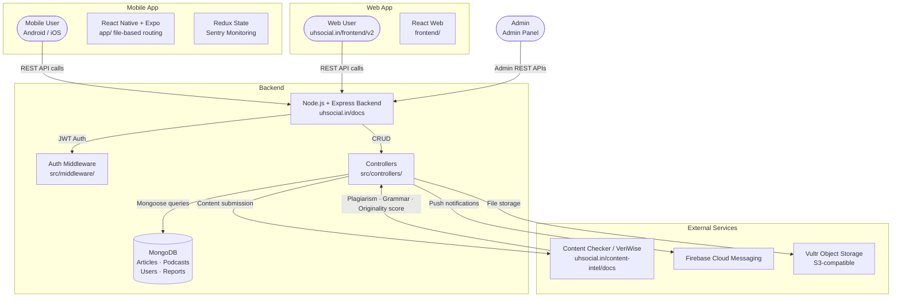
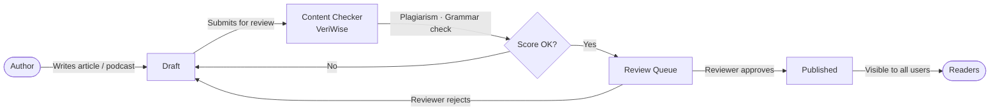

# UltimateHealth — Architecture

This document gives new contributors a quick mental model of how UltimateHealth is structured across its multiple repositories, how data flows through the system, and which files to open first depending on where you want to contribute.

---

## Multi-Repo Overview

UltimateHealth is split across four repositories:

| Repository | What it is |
|---|---|
| `SB2318/UltimateHealth` (main branch) | React Native + Expo mobile app (Android + iOS) |
| `SB2318/UltimateHealth` (web branch) | React web app — live at uhsocial.in/frontend/v2 |
| `SB2318/ultimatehealth-backend` | Node.js + Express REST API + MongoDB |
| `SB2318/ultimatehealth-admin` | Admin panel (moderation, analytics, user management) |
| `content-checker` | VeriWise — plagiarism detection, grammar, originality scoring |

---

## System Flow

---

## Content Contribution Flow

---

## Layer Breakdown

### 1. Mobile App — `SB2318/UltimateHealth` (main branch)
React Native app built with Expo, using **file-based routing** via Expo Router. State management uses Redux with strict TypeScript typing. Sentry is integrated for monitoring with request body redaction to protect health data. Audio playback (podcasts) uses a custom waveform visualizer. All API calls go through a centralized Axios instance with JWT handling and timeout management.

Key folders: `app/` (screens + routing), `components/`, `store/` (Redux), `services/` (API layer).

### 2. Web App — `SB2318/UltimateHealth` (web branch)
React web app served at `uhsocial.in/frontend/v2`. Lives in the `frontend/` folder of the main repo. Shares the same backend API as the mobile app. Contribute here if you're working on the web experience rather than the mobile app.

### 3. Backend — `SB2318/ultimatehealth-backend`
Node.js + Express REST API. Handles all business logic: article and podcast CRUD, collaborative review workflow, JWT authentication (access + refresh + verification tokens), content moderation (strikes, bans, flagging), admin analytics, and email notifications. Swagger UI is available at `uhsocial.in/docs`. File uploads go to Vultr Object Storage (S3-compatible).

Key folders: `src/controllers/`, `src/models/`, `src/routes/`, `src/middleware/`, `src/services/`.

### 4. Admin Panel — `SB2318/ultimatehealth-admin`
Dedicated dashboard for moderators and admins. Provides UI for content moderation, user management, strike/ban management, and platform analytics. Calls the same backend API as the mobile and web apps but uses admin-scoped JWT tokens and protected routes.

### 5. Content Checker / VeriWise
Separate microservice available at `uhsocial.in/content-intel/docs`. Runs plagiarism detection, grammar checking, and originality scoring on submitted articles before they enter the review queue. Called by the backend during content submission — contributors don't interact with it directly.

### 6. Auth — JWT (Three-Token System)
The backend issues three separate JWT types:
- **Access token** (15 min expiry) — for regular API requests
- **Refresh token** (7 days) — to obtain new access tokens
- **Verification token** (1 hour) — for email verification flows

All tokens use separate secrets for enhanced security.

### 7. Storage — Vultr Object Storage
S3-compatible object storage for article images, podcast audio files, and other media. Configured via `VULTR_ACCESS_KEY`, `VULTR_SECRET_KEY`, `BUCKET_NAME`, and `ENDPOINT_URL` in the backend `.env`.

### 8. Notifications — Firebase Cloud Messaging
Push notifications to mobile users for review updates, new articles, and moderation actions. Configured via `google-services.json` in the mobile app root.

---

## Key Files

### Mobile App
| File / Folder | What it does |
|---|---|
| `app/` | All screens and file-based routes (Expo Router) |
| `store/` | Redux state management |
| `services/` | Axios API layer — all HTTP calls |
| `google-services.json` | Firebase config for push notifications |
| `setup-android.sh` | Android dev environment setup script |

### Backend
| File / Folder | What it does |
|---|---|
| `src/index.js` | Express app bootstrap |
| `src/routes/` | All API route definitions |
| `src/controllers/` | Request handlers per domain |
| `src/models/` | Mongoose schemas (User, Article, Podcast, Report) |
| `src/middleware/` | JWT auth, validation, error handling |
| `src/services/` | Email, storage, and external integrations |
| `.env.example` | All required environment variables |

---

## Data Flow in Plain English

1. A user writes a health article in the mobile or web app.
2. On submission, the backend sends the content to the VeriWise content checker for plagiarism and grammar scoring.
3. If the score passes the threshold, the article enters the review queue.
4. A reviewer (role-based) approves or rejects the article via the app or admin panel.
5. On approval, the article is published and becomes visible to all users.
6. Firebase Cloud Messaging sends a push notification to the author.
7. Admins can monitor activity, manage users, and apply moderation actions via the admin panel.

---

## Getting Oriented as a New Contributor

### Mobile App (main branch)
1. Run `npm install && npx expo start` to get the app running.
2. Start in `app/` — screens follow file-based routing so the file name matches the route.
3. All API calls go through `services/` — never call Axios directly in a screen.
4. Redux store is in `store/` — follow existing slice patterns for new state.
5. Check `TEST_GUIDELINES.md` before writing tests.

### Backend
1. Run `yarn install`, copy `.env.example` to `.env`, fill in all keys, then `yarn start`.
2. Visit `http://localhost:PORT/docs` for the Swagger UI — explore all endpoints before coding.
3. New endpoints follow the pattern: `routes/` → `controllers/` → `models/`.
4. Look for issues labelled `good-first-issue` — adding API endpoints and improving Swagger docs are common beginner tasks.

### Web App (web branch)
1. Switch to the `web` branch: `git checkout web`.
2. The web app lives in `frontend/` — run `npm install && npm run dev` from there.

### Which branch to use
| Contribution type | Branch |
|---|---|
| Mobile app (React Native) | `main` |
| Web app (React) | `web` |
| Backend API | `ultimatehealth-backend` repo |
| Admin panel | `ultimatehealth-admin` repo |
